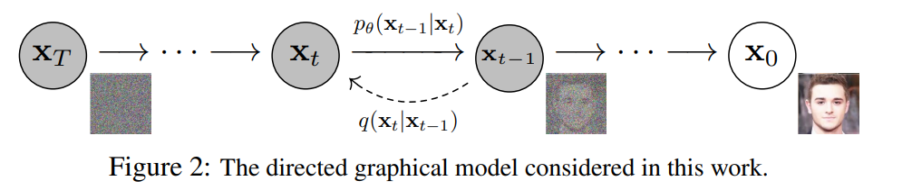
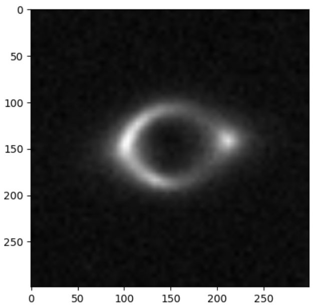
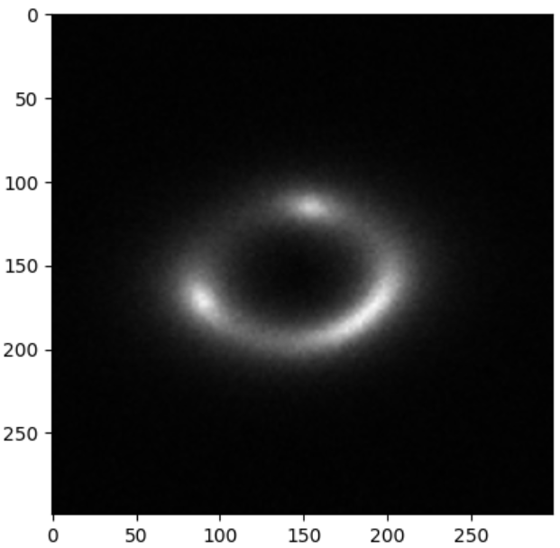

# Denoising Diffusion Probabilistic Models


## Prerequisites

To run this project, you will need:

- A CUDA-compatible GPU (highly recommended for accelerated computation)
- Anaconda or Miniconda installed on your system

## Environment Setup

We use Conda environments to manage dependencies and ensure reproducibility across different setups. Two separate environments are required for this project, one for PyTorch and another for TensorFlow, to prevent dependency conflicts.

### Installing Conda

If you haven't installed Anaconda or Miniconda yet, follow the instructions on the [official Conda website](https://conda.io/projects/conda/en/latest/user-guide/install/index.html) to set it up on your system.

### Creating the Environments

1. **PyTorch Environment**: This environment is optimized for projects using PyTorch. To create it, run the following commands in your terminal:

    ```bash
    conda create --name pytorch_env python=3.8
    conda activate pytorch_env
    conda install pytorch torchvision torchaudio cudatoolkit=11.1 -c pytorch -c nvidia
    pip install -r requirements.txt
    ```

    Replace `cudatoolkit=11.1` with the version that matches your CUDA installation.

2. **TensorFlow Environment**: This environment is set up for TensorFlow projects. Execute the following commands:

    ```bash
    conda create --name tensorflow_env python=3.8
    conda activate tensorflow_env
    pip install tensorflow
    pip install -r requirements.txt
    ```

    Ensure that the TensorFlow version installed is compatible with your CUDA and cuDNN versions.

### Requirements.txt

The `requirements.txt` file should list all the Python libraries that your project depends on. You might need different requirements files for each framework if the dependencies differ significantly. At a minimum, this file should contain:

```bash
numpy
pandas
matplotlib
scikit-learn
```


Add any other libraries your project depends on. If the libraries differ between the PyTorch and TensorFlow environments, consider creating two separate requirements files, e.g., `requirements_pytorch.txt` and `requirements_tensorflow.txt`.

## File Structure


- 📂 Root Directory
  - 📂 00_data 
  - 📂 01_EDA
  - 📂 02_Data_Preprocessing
  - 📂 03_Model
  - 📂 04_Data_Models
  - 📂 Results
  - 📄 Requirement.txt
  - 📄 readme.md


<br>

#### Download data file using this


```python

gdown --id 1cJyPQzVOzsCZQctNBuHCqxHnOY7v7UiA

```


## The Concept of DDPM

Denoising Diffusion Probabilistic Models (DDPMs) are a type of generative model that create images by starting from pure noise and gradually reducing that noise over many steps. This process is guided by a learned model that knows how to shape the noise into the desired image.

The process can be broken down into two main parts: the forward process and the reverse process.

### Forward Process

 In the `forward process`, the model starts with a real image and adds noise to it gradually over many steps until it becomes pure noise. This is done by applying a diffusion process, which is a type of stochastic process. The diffusion process is defined by a noise schedule, which determines how much noise to add at each step.

### Reverse Process

In the `reverse process`, the model starts with the pure noise image and gradually removes the noise over many steps to recreate the original image. This is done by applying a denoising process, which is guided by a neural network. The neural network is trained to predict the original image given the noisy image at each step.

The key idea behind DDPMs is that the forward process and the reverse process are designed to be the inverse of each other. This means that if you start with a real image, add noise to it using the forward process, and then remove the noise using the reverse process, you should end up with the original image. This property is what allows DDPMs to generate new images: by starting with pure noise and applying the reverse process, they can generate images that look like they could have come from the same distribution as the original images.

<br>
<br>




<br>


## Research Papers Referred

- [Denoising Diffusion Probabilistic Models](https://arxiv.org/pdf/2006.11239.pdf)
- [SPD-DDPM: Denoising Diffusion Probabilistic Models in the Symmetric Positive Definite Space](https://arxiv.org/pdf/2312.08200.pdf)
- [A friendly Introduction to Denoising Diffusion Probabilistic Models](https://medium.com/@gitau_am/a-friendly-introduction-to-denoising-diffusion-probabilistic-models-cc76b8abef25)


## YouTube Videos

- [Tutorial on Denoising Diffusion-based Generative Modeling: Foundations and Applications](https://www.youtube.com/watch?v=cS6JQpEY9cs&t=1930s)
- [Denoising Diffusion Probabilistic Models | DDPM Explained](https://www.youtube.com/watch?v=H45lF4sUgiE)
- [DDPM - Diffusion Models Beat GANs on Image Synthesis (Machine Learning Research Paper Explained)](https://www.youtube.com/watch?v=W-O7AZNzbzQ)

## Other Resources


- [Annotated_Deep_Learning_Paper_Implementations](https://github.com/labmlai/annotated_deep_learning_paper_implementations)
- [Detailed Implementation step by step](https://nn.labml.ai/diffusion/ddpm/index.html)


<br>


# Approach Explained 

In this project, we implemented a generative model using a combination of a U-Net architecture and Gaussian diffusion. 

The `U-Net architecture` was chosen due to its effectiveness in tasks involving image segmentation and denoising. It has a symmetric encoder-decoder structure that allows it to capture both high-level and low-level features in the image, making it ideal for our task.

`Gaussian diffusion` was used to gradually add noise to the image in the forward process and then gradually remove it in the reverse process. This approach allows us to shape the noise into the desired image over many steps, resulting in high-quality generated images.

The combination of these two techniques allowed us to effectively generate new images that look like they could have come from the same distribution as the original images.


## Unet Architecture 

1. **Efficient Training**: U-Net's symmetric architecture allows for efficient training, even with limited data, due to the use of extensive data augmentation.
2. **High Quality Outputs**: U-Net is known for producing high-quality segmentation results, especially in biomedical image segmentation.
3. **Contextual Information**: The architecture captures both local and global information by contracting and expanding paths, which helps in better understanding the context of the image.
4. **Less Prone to Overfitting**: Due to its architecture and the use of data augmentation, U-Net is less prone to overfitting compared to other models.
5. **Real-time Performance**: U-Net is capable of operating in real-time, making it suitable for applications that require immediate feedback.

<br>


```python

class UNet(nn.Module):
    def __init__(self, c_in=1, c_out=1, time_dim=256, device="cuda"):
        super().__init__()
        self.device = device
        self.time_dim = time_dim
        self.inc = DoubleConv(c_in, 64)
        self.down1 = Down(64, 128)
        self.sa1 = SelfAttention(128, 32)
        self.down2 = Down(128, 256)
        self.sa2 = SelfAttention(256, 16)
        self.down3 = Down(256, 256)
        self.sa3 = SelfAttention(256, 8)

        self.bot1 = DoubleConv(256, 512)
        self.bot2 = DoubleConv(512, 512)
        self.bot3 = DoubleConv(512, 256)

        self.up1 = Up(512, 128)
        self.sa4 = SelfAttention(128, 16)
        self.up2 = Up(256, 64)
        self.sa5 = SelfAttention(64, 32)
        self.up3 = Up(128, 64)
        self.sa6 = SelfAttention(64, 64)
        self.outc = nn.Conv2d(64, c_out, kernel_size=1)

    def pos_encoding(self, t, channels):
        inv_freq = 1.0 / (
            10000
            ** (torch.arange(0, channels, 2, device=self.device).float() / channels)
        )
        pos_enc_a = torch.sin(t.repeat(1, channels // 2) * inv_freq)
        pos_enc_b = torch.cos(t.repeat(1, channels // 2) * inv_freq)
        pos_enc = torch.cat([pos_enc_a, pos_enc_b], dim=-1)
        return pos_enc

    
    def forward(self, x, t):
        t = t.unsqueeze(-1).type(torch.float)
        t = self.pos_encoding(t, self.time_dim)

        x1 = self.inc(x)
        x2 = self.down1(x1, t)
        x2 = self.sa1(x2)
        x3 = self.down2(x2, t)
        x3 = self.sa2(x3)
        x4 = self.down3(x3, t)
        x4 = self.sa3(x4)

        x4 = self.bot1(x4)
        x4 = self.bot2(x4)
        x4 = self.bot3(x4)

        x = self.up1(x4, x3, t)
        x = self.sa4(x)
        x = self.up2(x, x2, t)
        x = self.sa5(x)
        x = self.up3(x, x1, t)
        x = self.sa6(x)
        output = self.outc(x)
        return output
    
```

## Diffusion Model

1. **High Quality Images**: Gaussian diffusion is capable of generating high-quality images by gradually shaping noise into the desired image over many steps.
2. **Control Over Noise**: The noise schedule in Gaussian diffusion allows for precise control over the amount of noise added at each step, enabling fine-tuning of the image generation process.
3. **Robustness**: The process is robust to variations in the noise schedule, making it adaptable to different datasets and tasks.
4. **Inverse Process**: The forward and reverse processes in Gaussian diffusion are designed to be the inverse of each other, which ensures that the generated images closely resemble the original ones.
5. **Scalability**: Gaussian diffusion can be scaled to work with large and high-dimensional datasets, making it suitable for a wide range of applications.


<br>


```python

class Diffusion:
    def __init__(self, noise_steps=1000, beta_start=1e-4, beta_end=0.02, img_size=64, device="cuda"):
        # Initialization of parameters for the diffusion model
        self.noise_steps = noise_steps  # Number of diffusion steps
        self.beta_start = beta_start    # Starting value of beta (variance schedule)
        self.beta_end = beta_end        # Ending value of beta (variance schedule)
        self.img_size = img_size        # Image size (assuming square images)
        self.device = device            # Device to run the model on (e.g., "cuda" or "cpu")

        # Prepare the noise schedule based on beta values and transfer it to the specified device
        self.beta = self.prepare_noise_schedule().to(device)
        self.alpha = 1. - self.beta                     # Alpha values calculated from beta
        self.alpha_hat = torch.cumprod(self.alpha, dim=0)  # Cumulative product of alpha values

    def prepare_noise_schedule(self):
        # Generates a linear schedule for beta values from beta_start to beta_end
        return torch.linspace(self.beta_start, self.beta_end, self.noise_steps)

    def noise_images(self, x, t):
        # Apply noise to images based on the timestep t
        sqrt_alpha_hat = torch.sqrt(self.alpha_hat[t])[:, None, None, None]
        sqrt_one_minus_alpha_hat = torch.sqrt(1 - self.alpha_hat[t])[:, None, None, None]
        Ɛ = torch.randn_like(x)  # Generate random noise
        return sqrt_alpha_hat * x + sqrt_one_minus_alpha_hat * Ɛ, Ɛ  # Return the noised image and the noise

    def sample_timesteps(self, n):
        # Sample random timesteps for each image in the batch
        return torch.randint(low=1, high=self.noise_steps, size=(n,))

    def sample(self, model, n):
        # Generate new images using the reverse diffusion process
        print(f"Sampling {n} new images....")
        model.eval()  # Set the model to evaluation mode
        with torch.no_grad():  # Disable gradient computation
            x = torch.randn((n, 1, self.img_size, self.img_size)).to(self.device)  # Start with random noise
            for i in tqdm(reversed(range(1, self.noise_steps)), position=0):  # Reverse diffusion process
                t = (torch.ones(n) * i).long().to(self.device)
                predicted_noise = model(x, t)  # Predict the noise to subtract
                alpha = self.alpha[t][:, None, None, None]
                alpha_hat = self.alpha_hat[t][:, None, None, None]
                beta = self.beta[t][:, None, None, None]
                if i > 1:
                    noise = torch.randn_like(x)  # Add random noise in intermediate steps
                else:
                    noise = torch.zeros_like(x)  # No noise in the final step
                # Reverse diffusion equation to denoise the image
                x = 1 / torch.sqrt(alpha) * (x - ((1 - alpha) / (torch.sqrt(1 - alpha_hat))) * predicted_noise) + torch.sqrt(beta) * noise
        model.train()  # Set the model back to training mode
        # Normalize the images to have values between 0 and 1
        x = (x.clamp(-1, 1) + 1) / 2
        x = (x - torch.amin(x))/(torch.amax(x) - torch.amin(x))
        return x

```


## Generated Images


## Problems Encountered

The main problem encountered was during the evaluation process as the initial generated the image was of shape (3,64,64) but the InceptionV3 model which is used to calculate the FID Score only takes input of size (3,299,299) so I had to upscale the data which lead to pixelation thus leading to a bad fid score. A work around to this problem would be to use a super resolution approach or an image resolution enhancement approach to increase the resolution of image after upscalling.


## Evaluation 

#### The first one is the generated image after upscalling and the second image of the sample after upscalling

<div style="display: flex; justify-content: space-around;" >
  
  
</div>

<br>

## FID Evaluation

FID stands for Fréchet Inception Distance. It is a metric used to assess the quality of images generated by generative models, like Generative Adversarial Networks (GANs).

FID measures the distance between the distribution of generated images and the distribution of real images. It does this by using a pre-trained Inception model to extract features from the images, and then computing the Fréchet distance between the two sets of features.

A lower FID score indicates that the distributions of real and generated images are closer to each other, which is generally interpreted as the generative model producing higher quality (more realistic) images. Conversely, a higher FID score suggests that the generated images have deviated more from the real ones.


```python

def get_inception_features(model, images_tensor):
    model.eval()
    features = []
    device = next(model.parameters()).device  # Get the device of the model's parameters
    with torch.no_grad():
        for img in images_tensor:
            # Assuming images_tensor is a batch of images with shape (N, C, H, W)
            # and already normalized
            if img.dim() == 3:  # If single image with C, H, W
                img = img.unsqueeze(0)  # Add batch dimension
                
                img = img.to(device, dtype=torch.float32) # Ensure the image tensor is on the same device as the model
            
            output = model(img)
            features.append(output.cpu().numpy())  # Assuming you want to work with NumPy arrays afterward
    
    features = np.concatenate(features, axis=0)
    return features


def calculate_fid(mu1, sigma1, mu2, sigma2):
    ssdiff = np.sum((mu1 - mu2) ** 2.0)
    covmean = sqrtm(sigma1.dot(sigma2), disp=False)[0]
    if np.iscomplexobj(covmean):
        covmean = covmean.real
    fid = ssdiff + np.trace(sigma1 + sigma2 - 2.0 * covmean)
    return fid

```

### FID Score : 229.57765373385138

<br>


# Conclusion

The FID score is high which can be improved ny increasing the image quality of the generated image.


